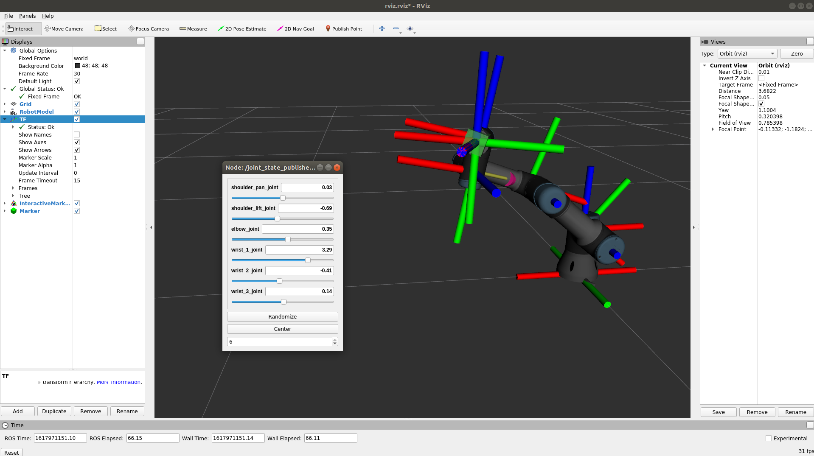
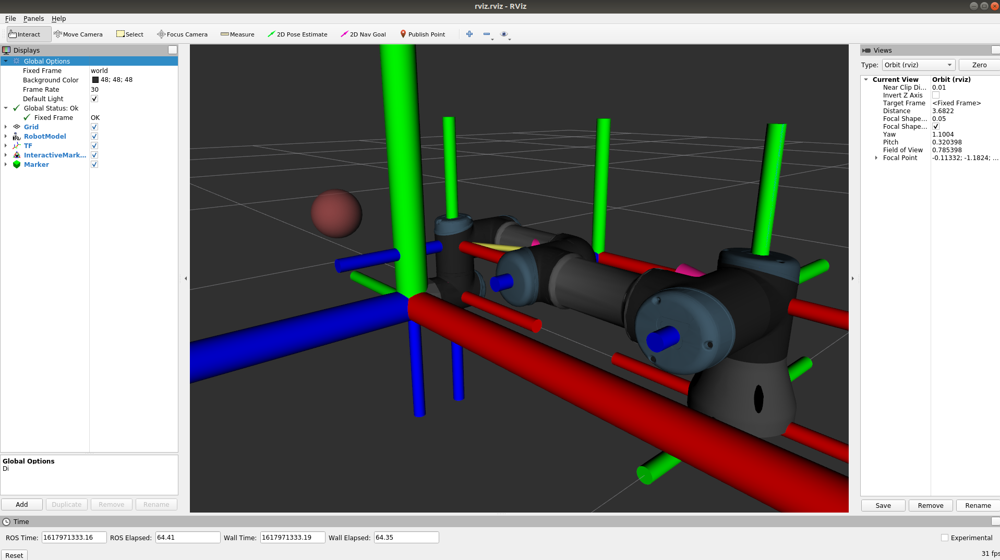

# robotics-ai-classes
Forward/inverse kinematics in Robot Operating System for the classes of the Artificial Intelligence bachelor studies.

# Installation

If you don't have the ROS Noetic on your PC installed, you might follow the instructions 
under **Installation/Using Docker** to use Docker for that. Otherwise, you should set up ROS Noetic on your own and skip 
to the **Installation/Manual installation**.

## Using Docker

To build and run locally the prepared docker container run the [build_and_run.sh](docker/build_and_run.sh) script with 
sudo priviliges. After it finishes, it should create and enter into the container under the path */catkin_ws*. 

Since now everything should work smoothly and you can focus on your assignments. Also, you can open as many terminals as 
you need (for the classes two terminals are suggested - terminator is a very helpful tool for that) and attach each 
window to the created container using:

```
sudo docker exec -it robotics_ai bash
```

Now you have multiple terminals of the same environment.


## Manual installation

Download that repositiory to the *catkin_ws/src* folder. Also, place there the software for the UR 
robotic manipulator.

```
cd /catkin_ws/src
git clone https://github.com/mbed92/robotics-ai-classes.git
git clone -b calibration_devel https://github.com/fmauch/universal_robot
sudo apt update -qq
rosdep update
rosdep install --from-paths src --ignore-src -y
source /catkin_ws/devel/setup/bash
```

# Assignments

In the course there are two assignments related to forward and inverse kinematics of a 6-DoF
robotic manipulator. Forward kinematics tasks are marked with a ``` ### [TODO FK] ... ``` comments,
while the inverse kinematics part is marked with ``` ### [TODO IK] ... ``` comments.

## Forward kinematics 


The task is to write the code that calculates the position and orientation of the green marker
with respect to the joint values (green box). As you move the robot with trackbars, the marker should
follow the tip of the robot. The repository contains code lines marked iwth a ``` ### [TODO FK] ... ``` comment. 
Look into them and fill that places with your code:
* in *move_robot/config/ur3.yaml* - define the UR3 robot with a DH parameters specified in [link](https://www.universal-robots.com/articles/ur/application-installation/dh-parameters-for-calculations-of-kinematics-and-dynamics/)
* in *move_robot/kinematics/KinematicsManager.py* - define a subscriber for joint states and publisher for the marker position 
* in *move_robot/kinematics/KinematicsManager.py* - implement the method that takes joint values and calculates the position and orientation of the end-effector

Run command:

```bash
roslaunch move_robot start_fk.launch
```

## Inverse kinematics 


The task is to write the code that calculates the robot's pose (i.e. joint values) given the position and
orientation of the interaction marker (three axes with a red sphere handle). As you move the interaction
marker with a mouse, the robot should adapt its pose to follow the marker. Look into lines with ``` ### [TODO IK] ... ``` and
fill them with your code:
* in *move_robot/kinematics/KinematicsManager.py* - write a publisher for calculated joint values
* in *move_robot/kinematics/JointStatePublisher.py* - implement your joint state publisher that publishes joint values from the inverse kinematics and updates the robot's pose
* in *move_robot/kinematics/KinematicsManager.py* - implement the inverse kinematics callbac function that caluclate the joint valuse w. r. t. to the end-effector pose


Run command:

```bash
roslaunch move_robot start_ik.launch
```